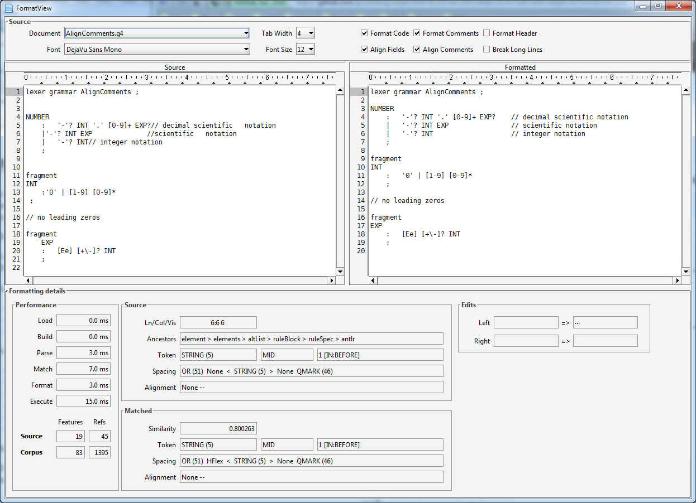

# Adept

A universal code formatter implemented using machine learning of aesthetic preferences. 
Includes a dedicated comment formatter that supports C/Java style block and line 
comment syntax, including formal JavaDoc. 

The Adept tool is designed for both stand-alone (CLI) and embedded use.

A suite of visualization tools serve as development aids as well as examples of embedded 
use. The `FormatView` visualization tool provides the most complete demonstration 
of use.

## Current built-in language support

- [x] ANTLR syntax
- [x] Java syntax
- [x] XVisitor syntax

## Formatting operations

- [x] Code formatter
- [x] Comment formatter
- [x] Skip header comment formatting option
- [x] Align code fields
- [x] Align comments
- [ ] Break long lines

## Status

ANTLR and XVisitor syntax implemented and tested. Java syntax partially implemented.

